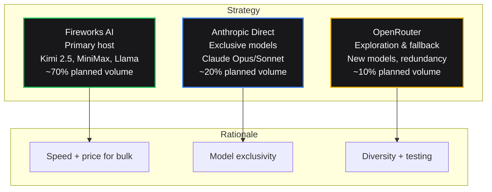

# API Provider Selection: Building a Testing Framework for Production AI Infrastructure

Choosing an API provider for language model access involves trade-offs between cost, latency, reliability, and model availability that shift as usage scales. We've experimented with direct integrations, aggregation layers, and optimized hosts—but our current conclusions rest on limited testing, not production data. This article documents our evaluation framework, the experiments we plan to run, and our provisional strategy pending systematic measurement.

## The Three Provider Categories

The current landscape offers three distinct approaches:

| Category | Examples | Primary Advantage | Key Limitation |
|----------|----------|-------------------|----------------|
| **Direct Provider** | Anthropic, OpenAI, Google | Exclusive models, guaranteed routing | Single point of failure, price rigidity |
| **Aggregation Router** | OpenRouter, Together AI | Price optimization, unified endpoint | Routing latency, less control |
| **Optimized Host** | Fireworks AI, Groq | Speed, reliability for supported models | Limited model catalog |

Each category optimizes for different variables. Our goal is a measurement framework that quantifies these trade-offs for our specific requirements.

## Category 1: Direct Provider Integration

### When It's Necessary

Some models require direct API access. As of March 2026:

- **Claude 4.6 (Opus/Sonnet):** Available only through Anthropic direct API[^1]
- **Google Gemini 2.0 Pro:** Requires Vertex AI or direct Google AI Studio access
- **New model releases:** Often exclusive to creator API for weeks or months

### What We Want to Test

**Question 1: Reliability variance by provider**

Direct providers represent single points of failure. Anthropic's infrastructure has experienced documented outages—most notably a multi-hour incident in March 2025 that disrupted services relying on Claude[^2]. We need systematic uptime monitoring to quantify this risk.

**Planned Test:**
- Synthetic health checks every 30 seconds from 4 regions
- Measure availability (defined as successful response within 10 seconds)
- Track error rate, latency spikes, and rate limiting behavior
- Compare against hosted alternatives for models available through both channels

**Question 2: "Switcheroo" risk**

Providers occasionally update model weights without notice. Anthropic's February 2026 infrastructure update changed output distributions for some Claude prompts[^3]. We want to detect this via automated drift monitoring.

**Planned Test:**
- A/B comparison of outputs on fixed prompt sets
- Statistical monitoring for distribution drift (KL divergence, embedding distance)
- Automated alerts when output characteristics change

**Question 3: Price rigidity cost**

Direct providers charge list price with no competitive pressure. We want to calculate the premium paid for exclusivity.

**Known Pricing (March 2026):**

| Provider | Model | Input/Output per 1M |
|----------|-------|---------------------|
| Anthropic | Opus 4.6 | $15.00 / $75.00 |
| Anthropic | Sonnet 4.6 | $3.00 / $15.00 |
| Fireworks | Kimi 2.5 | $0.80 / $0.80 |
| Fireworks | MiniMax 2.5 | $0.26 / $0.26 |

Opus costs 18.75× more per input token than Kimi. Whether that translates to 18.75× value depends on quality differential for specific tasks—measurement we plan to conduct.

## Category 2: Aggregation and Routing

### The OpenRouter Model

OpenRouter aggregates 50+ providers into a unified endpoint, automatically routing to the lowest-price option. Their value proposition centers on:

- **Price discovery:** Automatic selection of cheapest provider for each model
- **Model diversity:** Access to many models through single integration
- **Redundancy:** Fallback if one provider fails

### What We Want to Test

**Question 1: Routing latency impact**

The "best price" algorithm requires evaluation time. We want to measure the latency penalty versus direct provider access.

**Planned Test:**
- Compare TTFT for identical models (Llama 3.3 70B, Mixtral 8x22B) via OpenRouter versus direct Fireworks
- Test at varying request rates (1, 10, 50, 100 RPM)
- Measure p50, p95, p99 latency
- Track routing failures (cases where no provider responds within timeout)

**Hypothesis to Validate:** The price savings (OpenRouter claims 10–30% below direct pricing) may be offset by increased tail latency for latency-sensitive applications.

**Question 2: Routing consistency**

Dynamic routing based on provider availability creates non-determinism. Same prompt, different provider, potentially different output.

**Planned Test:**
- Send identical prompts repeatedly through OpenRouter
- Log which provider served each request
- Measure output variance across providers for same model name
- Calculate "consistency penalty" for price-optimized routing

**Question 3: Cost realization**

OpenRouter's "best price" guarantee claims lowest available rate. We want to verify actual spend against direct provider pricing.

**Planned Test:**
- Run identical workload through OpenRouter and direct Fireworks
- Compare total spend for same token volume
- Track " routing failures" that require retry
- Calculate true cost including failure handling

## Category 3: Optimized Hosting

### The Fireworks Approach

Fireworks AI specializes in speed-optimized inference for specific model families. They claim custom CUDA kernels, optimized attention mechanisms, and hardware co-location that outperform generic implementations.

### What We Want to Test

**Question 1: Speed claims verification**

Fireworks advertises 10× faster inference than alternatives for supported models. We want independent measurement.

**Planned Test:**
- Tokens-per-second measurement for Kimi 2.5, MiniMax 2.5, Llama 3.3 70B
- Compare Fireworks versus OpenRouter-served same models
- Test at 1K, 4K, 16K, 32K context sizes
- Measure both TTFT and sustained throughput

**Question 2: Reliability differential**

Fireworks claims 99.9%+ uptime. We want our own monitoring data.

**Planned Test:**
- 30-second synthetic health checks from 4 AWS regions
- Compare against OpenRouter and Anthropic direct
- Measure correlated failures (do all providers fail together, indicating client/network issues, or independently?)
- Track time-to-recovery after detected failures

**Question 3: Model catalog limitations**

Fireworks doesn't offer Claude or Gemini. We want to calculate the integration overhead of maintaining Fireworks + direct providers versus a single OpenRouter integration.

**Planned Analysis:**
- Catalog overlap: What percentage of our desired models are available on each platform?
- Integration cost: Time to add new model to Fireworks vs OpenRouter
- Fallback complexity: How many provider integrations needed for full coverage?

## Our Provisional Strategy

Based on limited experience—primarily initial testing and pricing analysis—we've adopted a three-provider approach:

**Figure 1:** Provisional provider allocation. Percentages represent target state, not current usage. Subject to change based on systematic testing results.

### Why This Allocation (Pending Validation)

| Provider | Hypothesis | Test Needed |
|----------|-----------|-------------|
| **Fireworks** | Best speed/price for non-exclusive models | Latency comparison, cost realization, reliability monitoring |
| **Anthropic Direct** | Required for Claude; safety training worth premium | Quality differential test, uptime comparison, switcheroo monitoring |
| **OpenRouter** | Cheapest for experimentation; acceptable latency for batch | Price realization, latency at volume, routing consistency |

## The Overhead Calculation

Maintaining multiple providers incurs cost beyond API spend:

| Provider Count | Integration Time | Ongoing Management | Failure Modes |
|---------------|------------------|-------------------|---------------|
| 1 | 8–16 hours | 1–2 hrs/month | Single point of failure |
| 2 | 16–24 hours | 3–4 hrs/month | Split by capability |
| 3 | 24–40 hours | 5–6 hrs/month | Tiered routing complexity |
| 4+ | 40+ hours | 8+ hrs/month | Diminishing marginal utility |

We're targeting three providers as a balance point. A fourth would add ~50% management overhead for unclear gain.

## Planned Internal Router

Long-term, we want a custom routing layer—not to replace providers, but to manage them:

**Requirements:**
- Health-check-based routing (not just price)
- Request-level caching to reduce redundant calls
- Automatic fallback chains
- Cost attribution by feature, not just by model
- Latency SLO enforcement (automatic fallback if p95 exceeded)

**Timeline:** Q2–Q3 2026 prototype. The goal is OpenRouter-like flexibility with our own reliability standards.

## Call for Data

If you have systematic measurements comparing:
- OpenRouter latency versus direct providers
- Fireworks throughput claims versus reality
- Provider reliability (uptime, error rates) from production monitoring

—we would welcome exchange. Isolated anecdotes help less than structured data. Standardized testing methodologies would benefit the ecosystem.

Contact: [lab@promptengines.com]

---

## Testing Roadmap

| Test | Timeline | Success Criteria |
|------|----------|-----------------|
| Latency benchmark (all providers, 4 models) | April 2026 | Statistical comparison with confidence intervals |
| Reliability monitoring (30 days) | April–May 2026 | Availability percentages, failure correlation analysis |
| Cost realization (controlled workload) | May 2026 | Actual spend versus quoted pricing, hidden cost identification |
| Routing consistency (OpenRouter) | May 2026 | Output variance measurement across provider switches |
| Integration overhead audit | June 2026 | Time-tracking for provider management, MTTR by provider |

---

## Current State: Explicit Limitations

**What We Know:**
- Pricing structures (public, verifiable)
- Feature availability (which models on which platforms)
- Anecdotal performance in limited testing

**What We Don't Know (Pending Tests):**
- Latency distributions at production scale
- True reliability differentials (our monitoring duration is insufficient)
- Cost realization with retry logic included
- Output consistency across routing strategies
- Integration overhead at sustained volume

**What We're Doing:** Building the measurement framework to replace assumptions with data.

---

## Sources

[^1]: Anthropic API documentation. https://docs.anthropic.com. Accessed March 2026. Confirms Claude 4.6 models available only via direct API.
[^2]: "Anthropic resolves API issues after several-hour outage." TechCrunch, March 5 2025. https://techcrunch.com/2025/03/05/anthropic-resolves-api-issues-after-several-hour-outage/
[^3]: Anthropic infrastructure update announcement, February 14, 2026. Provider documentation notes potential output distribution changes during infrastructure transitions.
[^4]: OpenRouter pricing and routing documentation. https://openrouter.ai/docs. Accessed March 2026.
[^5]: Fireworks AI performance claims. https://fireworks.ai/why-fireworks. Accessed March 2026.
