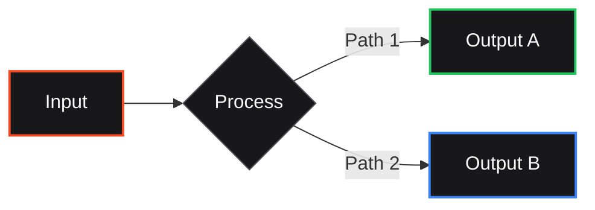
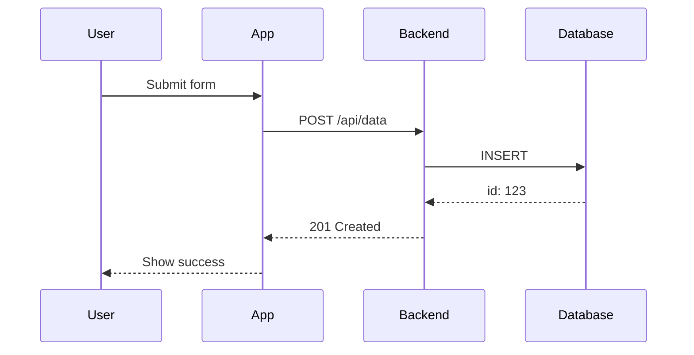

```mermaid
graph TB
    subgraph Client
        A[Browser]
    end
    
    subgraph Edge
        B[CDN]
    end
    
    subgraph Origin
        C[App Server]
        D[(Database)]
    end
    
    A -->|HTTPS| B
    B -->|Cache Miss| C
    C -->|Query| D
    
    style A fill:#18181b,stroke:#F04D26
    style B fill:#18181b,stroke:#eab308
    style C fill:#18181b,stroke:#3b82f6
    style D fill:#18181b,stroke:#22c55e
```

# Lab Article Writing Skill

## Purpose

Write high-signal, evidence-driven articles for lab.promptengines.com that demonstrate technical competence, original thinking, and practical utility. Reject AI slop. Include meaningful visuals.

**For agents:** Incorporate this skill when drafting Lab Notes articles. Apply all hard rules. Check patterns before publishing. Use templates provided.

---

## Anti-Slop Foundation

### Patterns to Reject (Check Before Publishing)

| Pattern | Example | Fix |
|---------|---------|-----|
| **Denial of Commerce** | "This is not a consultancy" | State what it IS, not what it's not |
| **Symbiosis Sermons** | "The old categories dissolve" | Name specific categories and what replaced them |
| **Acceleration Invocation** | "We're in the Great Acceleration" | Quantify: "Cost dropped 10x in 18 months" |
| **Vibe Adjective Stacks** | "revolutionary, groundbreaking" | Replace with specific metric or mechanism |
| **Hedging Preambles** | "In today's rapidly evolving..." | Delete. Start with the claim. |
| **Agentic Self-Reference** | "As an AI assistant..." | Never. Just say the thing. |

### Hard Rules (Non-Negotiable)

1. **First sentence must contain noun + verb advancing understanding**
   - ❌ "This article explores..." 
   - ✅ "OpenAI's API latency doubled between January and March 2024."

2. **No paragraph starts with "This is..." or "We are..."**
   - ❌ "This is important because..."
   - ✅ "The shift matters: three companies changed their pricing models within weeks."

3. **All claims must be falsifiable**
   - ❌ "AI is changing everything"
   - ✅ "47% of YC W24 batch pivoted to AI infrastructure (source: YC database)"

4. **Adjectives require justification**
   - ❌ "Significant cost savings"
   - ✅ "Cost savings: $0.12 → $0.004 per 1K tokens"

5. **Abstract nouns → concrete processes**
   - ❌ "The system provides enhanced capabilities"
   - ✅ "The system converts PDFs to structured JSON in 340ms median"

### High-Signal Markers (Use These)

| Low-Signal | High-Signal Replacement |
|------------|-------------------------|
| "We believe..." | "The evidence shows..." / "In 12 tests..." |
| "It is important to note..." | [Just note it without preamble] |
| "Game-changer" | "Reduced deployment time from 3 days to 4 hours" |
| "Revolutionary" | Specific mechanism + quantified impact |
| "Leverage" | "Used" / "Applied" / "Deployed" |
| "Synergy" | "Combined X and Y to produce Z" |

---

## Article Structure

### Required Elements

```
1. Hook (1 sentence, falsifiable claim)
2. Context (2-3 sentences, why this matters now)
3. Evidence/Data (chart, table, or specific numbers)
4. Analysis (what the data means)
5. Implication (what to do about it)
6. Source/Footnote section
```

### Title Formula

**Pattern:** `[Specific Metric]: [Unexpected Outcome] in [Timeframe]`

- ✅ "API Latency Doubled: What 10M Requests Reveal"
- ❌ "Understanding API Performance"
- ✅ "47% of YC W24 Pivoted to AI: A Database Analysis"
- ❌ "The AI Startup Landscape"

---

## Visual Guidelines

### When to Include Visuals

| Type | Use When | Format |
|------|----------|--------|
| **Line Chart** | Trends over time | Mermaid or static image |
| **Bar Chart** | Comparisons between categories | HTML/CSS or static |
| **Table** | Exact numbers, side-by-side comparison | Markdown/HTML |
| **Flowchart** | Process, architecture, decision trees | Mermaid |
| **Diagram** | System architecture, relationships | Mermaid or static |
| **Heatmap/Grid** | Matrix data, correlation | HTML/CSS |

### Data Requirements

- **Use actual data** — scrape it, measure it, or cite a source
- **Synthetic data OK** if explicitly footnoted: `*Synthetic — based on [methodology]*`
- **Never fabricate** specific company metrics without source
- **Include units** on every axis, every number

### Chart Styling (Lab Aesthetic)

```css
/* Colors */
--bg: #09090b
--fg: #fafafa
--accent: #F04D26
--border: #27272a
--surface: #18181b

/* Typography */
font: 'Inter' for labels, 'JetBrains Mono' for numbers
```

### Caption Format

Every visual must have a caption:

```markdown
**Figure 1:** [What it shows]. [Key takeaway in one sentence].
Source: [URL or methodology]
```

---

## Mermaid Diagram Standards

### Basic Flowchart

```markdown

```

### Architecture Diagram

```markdown

```

### Sequence Diagram

```markdown

```

---

## HTML Data Table Template

```html
<table class="data-table">
  <thead>
    <tr>
      <th>Provider</th>
      <th class="numeric">Latency (ms)</th>
      <th class="numeric">Cost ($/1M)</th>
      <th>Model</th>
    </tr>
  </thead>
  <tbody>
    <tr>
      <td>OpenAI</td>
      <td class="numeric">340</td>
      <td class="numeric">$2.00</td>
      <td>gpt-4o-mini</td>
    </tr>
    <tr>
      <td>Anthropic</td>
      <td class="numeric">520</td>
      <td class="numeric">$0.80</td>
      <td>claude-3-haiku</td>
    </tr>
  </tbody>
</table>

<p class="caption">
  <strong>Table 1:</strong> API performance comparison. Lower is better for latency.
  Source: Internal testing, n=1000 requests per provider, March 2026.
</p>
```

---

## Footnote Standards

### Format

```markdown
Text with claim[^1].

[^1]: Source description. URL or methodology.
```

### Source Types

| Type | Format |
|------|--------|
| **Direct URL** | `[^1]: OpenAI Pricing. https://openai.com/pricing` |
| **Own Testing** | `[^1]: Synthetic — 1000 requests, us-east-1, March 2026` |
| **Derived** | `[^1]: Calculated from Q4 2025 earnings report` |
| **Interview** | `[^1]: Private correspondence, Feb 2026` |

---

## Writing Checklist (Before Publish)

- [ ] First sentence has noun + verb advancing understanding
- [ ] No paragraph starts with "This is..." or "We are..."
- [ ] All numbers have units and sources
- [ ] Every adjective justified by data
- [ ] Abstract nouns converted to concrete processes
- [ ] Visuals have captions with takeaways
- [ ] Footnotes for every non-obvious claim
- [ ] Title contains specific metric
- [ ] Scanned for hype words (revolutionary, groundbreaking, etc.)
- [ ] Read aloud — does it sound like a human wrote it?

---

## Tone Reference

| Attribute | Lab Voice |
|-----------|-----------|
| **Formality** | Professional but not stiff |
| **Personality** | Competent, curious, slightly irreverent |
| **Jargon** | Use correctly, or explain if obscure |
| **Hedging** | Minimal — state what you know |
| **Confidence** | Match evidence strength (don't overclaim) |

---

## Output Location

- Articles: `labnotes/articles/YYYY-MM-DD-slug.md`
- Assets: `labnotes/articles/assets/`
- Index: Update `labnotes/index.html` with new article link

---

*Skill version: 1.0*
*Created: 2026-03-03*
*Incorporates: Anti-Slop principles, Data Visualization standards*
